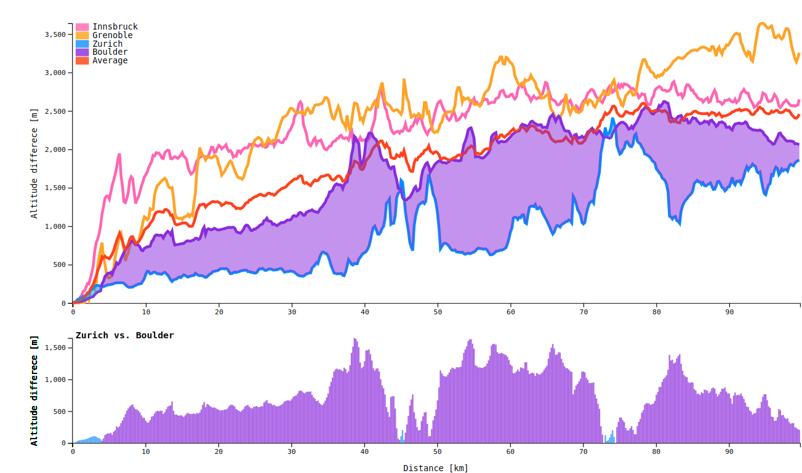

## Area between lines colored based on highest values

This script uses [d3.js](https://github.com/d3/d3) to create a chart of two lines and draw the area between them.
The area is colored based on the color of the line which has the highest Y value.
The plot is connected with a bar Chart in the bottom showing the Y difference between the two lines.

